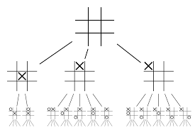
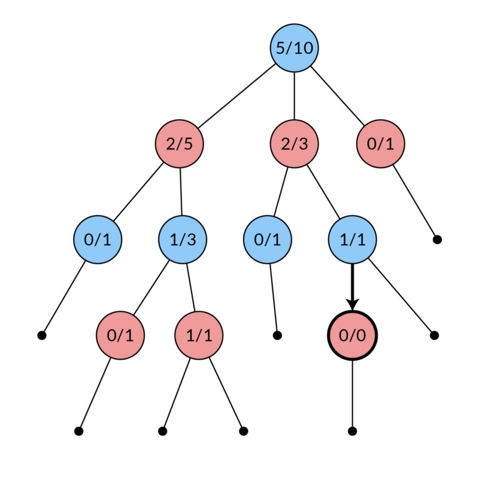
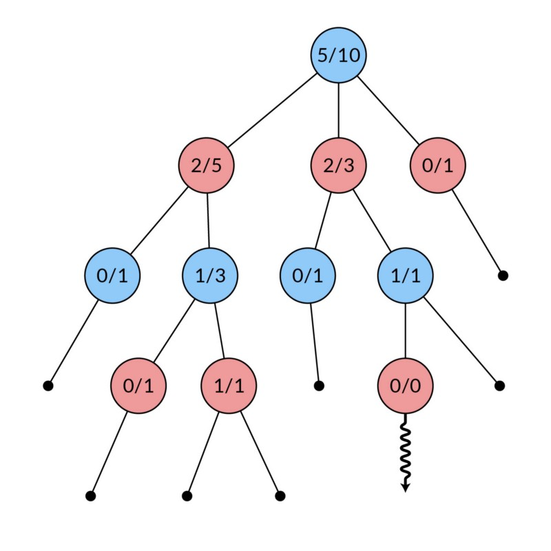
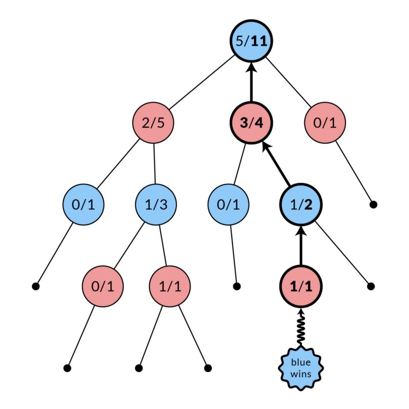

# AlphaZero and Keras Models

## MCTS

### Game Trees
To understand MCTS, we first need an understanding of Game Trees.
Let's take a simple example of Tic Tac Toe. In this game, (and most other games) there are 2 main concepts: states and moves.
In Tic Tac Toe a state would be a board and any configuration of X's and O's in it with each configuration being a different state. However, not every configuration is going to be a state, as only states that are possible to reach following the rules of the game are considered valid game states.

A move is the way that you would play the game. Of course in tic tac toe not every single move is possible. For example, if a square already has an x placed on it you wouldn't be able to place another x on it. Another characteristic of a move is that it has the ability to move you to another state. (In some games, doing nothing could be a move) In Tic Tac Toe, however, making a move would guarantee that you get to another state

(This is an game state where there are 9 possible moves next turn)

A game tree would be composed of states and moves. Where states are the nodes of the tree and moves are the edges along the tree.
In tic tac toe, the starting node would always be an empty 3x3 grid. From the starting node, there are 9 possible moves that are going to lead to a new state.



Notice on layer 1 where the states just consist of a X in one position. These are all going to be leaf nodes of the root node since you can get to these states from the root node. This is not going to be the full tree, however you can imagine that there are nine leaf nodes on the layer below the root node.

### MCTS in the Wild
The first thing that we want to understand is that Monte Carlo Tree Search (MCTS) can be applied to zero-sum games. A zero-sum game is a game where you win by having the opponent lose. It is convention to assign a value to each player in the game state. Where when a player wins they get the value of 1, when they lose they would get the value of -1, and when they tie both players get a value of 0. That way no matter the outcome, the sum of you and your opponents values are going to be equal to zero. To make algorithims to win at this game we go under the asssumption that your opponent is trying to make you lose (so that they can win), which leads to several algorithims.
Alpha Zero is based on the Monte Carlo Tree Search (MCTS) algorithm: the objective of this algorithim is to find the optimal (or very close to) action without exploring every node in the game tree. In games like tic tac toe -- where the game space is small -- it is very inexpensive to scour the entire game tree and apply an algorithim such as [minimax](https://www.baeldung.com/java-minimax-algorithm)
However, in games like chess, it is simply impossible to explore all the nodes in the tree. That is why we use the MCTS to get an approximation of the best move. The MCTS algorithm consists of four parts: Selection, Expansion, Simulation, Backpropagation. I am going to go into this in a relatively high-level, but if you want to read more into it there is a good blog [here](https://medium.com/@quasimik/monte-carlo-tree-search-applied-to-letterpress-34f41c86e238)

The first part is going to be selection. Assuming you have a tree in place, however the tree isn't completely explored. Also each node in the tree is going to have additional information other than the state, the amount of times visiting that node and the amount of wins from that node. The selection function is going to use an algorithim that balances exploring new stuff and the value of the state. This process happens in the middle of the tree; it is run repeadetly until it reaches an edge node.

Then the next part is expanding. You choose a random leaf node from the node that you selected and add it to your tree.



Then you simulate. In conventional MCTS you randomly move until you reach an ending state. You keep track of the wins and losses.

Then you backpropogate. You go up the tree that you have in place and depending on whether you won or lost you update the values in each node accordingly, in hopes for a better understanding of how that node is.

### In the Model
While our MCTS algorithim shares many similarities to the conventional MCTS, it also has many differences. The main one being that instead of simulating randomly, we basically trust our model to handle simulating. And, in the selection process we incorporate our model predictions in the function behind choosing the path to the leaf node. We also add every node in the expansion, instead of only doing one.

Our selection process is very similar

```python
while not currentNode.isLeaf():

    maxQU = -99999

    if currentNode == self.root:
        epsilon = config.EPSILON
        nu = np.random.dirichlet([config.ALPHA] * len(currentNode.edges))
    else:
        epsilon = 0
        nu = [0] * len(currentNode.edges)
    #Set up the values to be used in the function for selecting

    Nb = 0
    for action, edge in currentNode.edges:
        Nb = Nb + edge.stats['N']
    #sum up the total edges visited in the leaf nodes

    for idx, (action, edge) in enumerate(currentNode.edges):

        U = self.cpuct * \
            ((1-epsilon) * edge.stats['P'] + epsilon * nu[idx] )  * \
            np.sqrt(Nb) / (1 + edge.stats['N'])
        #a function of P (from the model prediction) and N the number of times visiting this node representing how unknown going down the current edge is 
        Q = edge.stats['Q']
        # The average value of going down this path representing how likely you are going to win

        if Q + U > maxQU:
            # Get the max Q+U and keep track of the action and edge that it is
            maxQU = Q + U
            simulationAction = action
            simulationEdge = edge

    newState, value, done = currentNode.state.takeAction(simulationAction) 
    #take the action with the highes q+u
    currentNode = simulationEdge.outNode
    #Get the node that the edge leads to
    breadcrumbs.append(simulationEdge)
    #add the edge to breadcrumbs so that you know what to backfill

#Ends once we get to a leaf node
```
This code will go through a path by starting at the root node and going down the game tree one level at a time. At each level, you have a `currentNode` and going through all the edges from that node. Then, you find the edge with the maximum Q+U and then set `currentNode` as the node that that paticular edge ends at.
In our function, Q (the average value) is going to represent how likely you are to win if you traverse down that edge. U is going to represent how unknown that edge is. You want to go down edges that you know are going to lead to a win, and you also want to go down edges that have a lot of potential and that is why you have a Q and a U. Note that the U is trying to find nodes that the model deems to have a high reward, and it hasn't explored that much.


```python
if done == True:

    value, probs, allowedActions = self.get_preds(leaf.state)
    #get_preds is the function that plugs the state of the game into the model
    probs = probs[allowedActions]
    #Only keep the valid moves in the probs array

    for idx, action in enumerate(allowedActions):
        newState, _, _ = leaf.state.takeAction(action)
        #Get the state if you take the action
        if newState.id not in self.mcts.tree:
            node = mc.Node(newState)
            self.mcts.addNode(node)
            #If the state doesn't exist in the node add the new node to the tree
        else:
            node = self.mcts.tree[newState.id]
            #Otherwise just get the information from the node from the tree

        newEdge = mc.Edge(leaf, node, probs[idx], action)
        leaf.edges.append((action, newEdge))
        #Connect the new node to the current leaf node
        
else:
    #This means that the value is already set, which means you do not need to evaluate or add the node

return ((value, breadcrumbs))

```
This is going to be the expansion part of MCTS. Which is pretty much the exact same as the textbook MCTS defintion.

```python
for edge in breadcrumbs:
    #go up the tree
    playerTurn = edge.playerTurn
    if playerTurn == currentPlayer:
        direction = 1
    else:
        direction = -1
    # get whether value should be positive or negative
    edge.stats['N'] = edge.stats['N'] + 1
    edge.stats['W'] = edge.stats['W'] + value * direction
    edge.stats['Q'] = edge.stats['W'] / edge.stats['N']
    #update stats

```
Pretty standard backfill code. Go up the edges of the tree and update them as you go along.

#Model
With the MCTS Algorithim in place, we turn our attention to the model.
Our model is going to take in a game state and return a float estimating the value of that state, and a logit array.

In other words are model is composed of two sub-models a model to get the value of the current state and one to get the predictions for the actions that should be taken.

```python
main_input = Input(shape = self.input_dim, name = 'main_input')
#Set a placeholder for the input
x = self.conv_layer(main_input, self.hidden_layers[0]['filters'], self.hidden_layers[0]['kernel_size'])
#Have a conv layer since both sub-models need to detect local features for it to be successful
if len(self.hidden_layers) > 1:
    for h in self.hidden_layers[1:]:
        x = self.residual_layer(x, h['filters'], h['kernel_size'])
#get the value and policy
vh = self.value_head(x)
ph = self.policy_head(x)

#set the model as a dual output
model = Model(inputs=[main_input], outputs=[vh, ph])
model.compile(loss={'value_head'+str(self.version_number): 'mean_squared_error', 'policy_head'+str(self.version_number): softmax_cross_entropy_with_logits},
    optimizer=SGD(lr=self.learning_rate, momentum = config.MOMENTUM),   
    loss_weights={'value_head'+str(self.version_number): 0.5, 'policy_head'+str(self.version_number): 0.5}  
    )

```

## Why Deep Networks
Hypothetically, having a model that is one hidden layer would be able be able to produce similar results to any Deep Networks, so why do it?

There are multiple reasons for this structure. First, while it is mathmatically possible to emulate a deep model with a wide model. By creating a wide models it ends up emulating the function rather than actually being the function.

By creating a function with multiple layers with nonlinearities on each function, it allows the predictions to use relatively little weights, compared to the wide model. Therefore it creates a smoother model, and it actually learns the task at hand.

For example, at the bottom layer of a model, what you are concerened with is the movement of the pawns. And perhaps, at the higher level, you would be worrying about how the different pieces protect each other. I raise these examples because it shows how you start from a local task, and it goes up the layers and addresses the total problem.

## Our Model
With the logic to use deep networks to abstract things. Our model consists of a stack of Convolutional layers using pooling.

```python
def conv_layer(self, x, filters, kernel_size):

    x = Conv2D(
    filters = 75
    , kernel_size = (4,4)
    , data_format="channels_first"
    , padding = 'same'
    , use_bias=False
    , kernel_regularizer = regularizers.l2(self.reg_const)
    )(x)

    #have 75 4x4 kernels form the convolution layer

    x = BatchNormalization(axis=1)(x)
    #normalize batches to allow the gradients to converge faster
    x = LeakyReLU()(x)
    #Activation Function that is needed in Deep Networks to be effecive

    return (x)
```

However, with deeper models, there is a new problem introduced: Gradient vanishing. This concept happens because the gradients have to travel a large distance. So much of the original meaning of the gradient is lost. To combat this we introduce a layer called a resiudal layer. By adding the input of the current layer to the output, we are able to keep the original meaning of the gradients throughout the layers, because it is added directly to the output of the layer.


```python
x = self.conv_layer(input_block, filters, kernel_size)  
#Have the previous convolution layer
x = Conv2D(
filters = filters
, kernel_size = kernel_size
, data_format="channels_first"
, padding = 'same'
, use_bias=False
, activation='linear'
, kernel_regularizer = regularizers.l2(self.reg_const)
)(x)

x = BatchNormalization(axis=1)(x)

x = add([input_block, x])
#adds the input to the output to preserve gradients
x = LeakyReLU()(x)
#basically another convolution layer
return (x)
```

##Value Head and Policy Head

```python
    def value_head(self, x):

        x = Conv2D(
        filters = 1
        , kernel_size = (1,1)
        , data_format="channels_first"
        , padding = 'same'
        , use_bias=False
        , activation='linear'
        , kernel_regularizer = regularizers.l2(self.reg_const)
        )(x)


        x = BatchNormalization(axis=1)(x)
        x = LeakyReLU()(x)

        x = Flatten()(x)
        #Flatten inputs
        x = Dense(
            20
            , use_bias=False
            , activation='linear'
            , kernel_regularizer=regularizers.l2(self.reg_const)
            )(x)

        x = LeakyReLU()(x)

        x = Dense(
            1
            , use_bias=False
            , activation='tanh'
            , kernel_regularizer=regularizers.l2(self.reg_const)
            , name = 'value_head'+str(self.version_number)
            )(x)

        #Use two dense layers to turn the shape into [b,1]


        return (x)

    def policy_head(self, x):

        x = Conv2D(
        filters = 2
        , kernel_size = (1,1)
        , data_format="channels_first"
        , padding = 'same'
        , use_bias=False
        , activation='linear'
        , kernel_regularizer = regularizers.l2(self.reg_const)
        )(x)

        x = BatchNormalization(axis=1)(x)
        x = LeakyReLU()(x)

        x = Flatten()(x)

        x = Dense(
            self.output_dim
            , use_bias=False
            , activation='linear'
            , kernel_regularizer=regularizers.l2(self.reg_const)
            , name = 'policy_head'+str(self.version_number)
            )(x)
        #Convert shape to outputdim so that they can be used as logits [b,output_dim]
        return (x)
```
For both the value_head function and policy_head function we start off with a Convolution layer with kernels of size 1. Then, we use Dense layers (xW+b) to shape the layers into the desired shapes.


# Basics of Tensorflow JS

## Introduction
With a trained keras model, it is possible to use tensorflowjs to convert the model to an online demo. While tensorflowjs is hard to use, it was able to do its job. 

## Getting model.json
The first thing you would do is download the tensorflow js converter in pip.
```
pip install tensorflowjs
```
(Note: you have to have a tensorflow version of 1.9 or higher for this to work.)

Run this function from the python file to generate an h5 file.
```python
model.save(run_folder+name+ '.h5')
```

With an h5 file in hand, run the following line in the command prompt.
```
tensorflowjs_converter --input_format keras model.h5 target_dir
```
If this runs successfully there should be a model.json file and a bunch of shards in the target_dir. The target_dir is going to make up the model. There are some issues with the version, as tensorflow 1.8 doesn't support tensorflowjs, but tensorflow 1.9 gives you an error about version. So if you ran into this problem, you can use an online enviorment.

## TensorflowJS in Javascript	
There are two basic ways to set up your javascript file for tfjs.
1. In the html file where you reference your own js file you add this additional statement
```
<script src="https://cdn.jsdelivr.net/npm/@tensorflow/tfjs@latest"> </script>
```
2. In the begenning of the Javascript file add an import statement
```javascript
import * as tf from '@tensorflow/tfjs';
```

The second approach seems a lot more prone to error. While the second method should have worked (it worked in the tensorflowjs examples) I wasn't able to get it to work.

Another thing to note about the tensors is the shape that they are expecting

I had an error where tfjs complained about an error where they wanted a shape of [,2,3,3] it is expecting the shape of [1,2,3,3], and you aren't directly able to shape it to [,2,3,3].

Perhaps one of the most intersting things about tfjs is that when trying to use the model the tf.loadModel is set up as an callback function. If you don't want your entire script to be asynchronous then you can use an async function to set up the model like I did and then call from a synchrounous.
(If you want to know about async functions check [this](https://medium.com/codebuddies/getting-to-know-asynchronous-javascript-callbacks-promises-and-async-await-17e0673281ee) out)
```python
async function start() {
    //arabic or english
    
    var testarray = [[[[0,0,0],[0,0,0],[0,0,0]],[[0,0,0],[0,1,0],[0,0,0]]]];

    var test = tf.tensor(testarray);

    //const testagain = test.reshape([,2,3,3]);
    //load the model 
    model = await tf.loadModel('tfjs/model.json');
    
    //warm up 
    const output = model.predict(test);
    
    logits_array = output[1].dataSync();
    console.log(logits_array);
}
```
The predict function is pretty self-explanitory except that you need to feed it an input in the format of tf.tensor for it to be able to work.

the await keyword means that the function means that you are going to finish the execution of tf.loadModel() before you continue to the next line of code. While this is very self-explanitory in synchronous code async functions are another subject that I'm not going to go into.

The model returns a tuple of [predictedValue, logits] each of them are in the form of a tensor. Perform a dataSync on it so it gets turned from tf.tensor to a javascript array where I would be able to manipulate it easily.
 
```
tfjs@latest:2 Uncaught (in promise) Error: 2 of 68 weights are not set: value_head/kernel,policy_head/kernel.
```
This was the most irritating error I got.

In the model.json file the kernel weights were set as value_head_1 and policy_head_1. This problem originates from having two variables with the same name. There are two ways to solve this, to manually go into the model.json file and change the value_head_1 to value_head or give the two variables two different names value_head1 and value_head0 which is what I ended up doing.

This seems to be an error on tensorflowjs's part. Because while importing the model from an h5 file works perfectly fine, when making multiple of the same variable and then converting in a form that tfjs can use results in the kernel file adding an automatic ```_x``` with x being the number. This would work, however it fails to update the other parts that is looking for the kernel variable.

## Conclusion
While still irritiating and painful to deal with, TensorflowJS has potential.

# Demo
<html>
<head>
<script src="https://cdn.jsdelivr.net/npm/@tensorflow/tfjs@latest"> </script>


<script src="backend.js" defer></script> 


</head>
<body>
	
<form name="game">
<div align="center"><center><table border="0">
<TBODY>
<tr>
<td><table border="1" borderColor="#000000" cellPadding="0" cellSpacing="0">
<TBODY>
<tr>
<td><a id ="A"></a></td>
<td><a id ="B"></a></td>
<td><a id = "C"></a></td>
</tr>
<tr>
<td><a id="D"></a></td>
<td><a id = "E"></a></td>
<td><a id="F"></a></td>
</tr>
<tr>
<td><a id="G"></a></td>
<td><a id="H"></a></td>
<td><a id = "I"></a></td>
</tr>
</TBODY>
</table>
</td>
<td><table>
<TBODY>
<tr colspan="2">
<td><font face="MS Sans Serif" size="1"><b>Score:</b></font></td>
</tr>
<tr>
<td><font face="MS Sans Serif" size="1"><input name="you" size="5"
style="font-family: MS Sans Serif; font-size: 1"></font></td>
<td><font face="MS Sans Serif" size="1">You</font></td>
</tr>
<tr>
<td><font face="MS Sans Serif" size="1"><input name="computer" size="5"
style="font-family: MS Sans Serif; font-size: 1"></font></td>
<td><font face="MS Sans Serif" size="1">Computer</font></td>
</tr>
<tr>
<td><font face="MS Sans Serif" size="1"><input name="ties" size="5"
style="font-family: MS Sans Serif; font-size: 1"></font></td>
<td><font face="MS Sans Serif" size="1">Draw</font></td>
</tr>
</TBODY>
</table>
</td>
</tr>
</TBODY>
</table>
</center></div>

<div align="center"><center><p><input id ="button"
value="New Game"
style="font-family: MS Sans Serif; font-size: 1; font-weight: bold"> </p>
</center></div>
</form> 

</body>
</html>